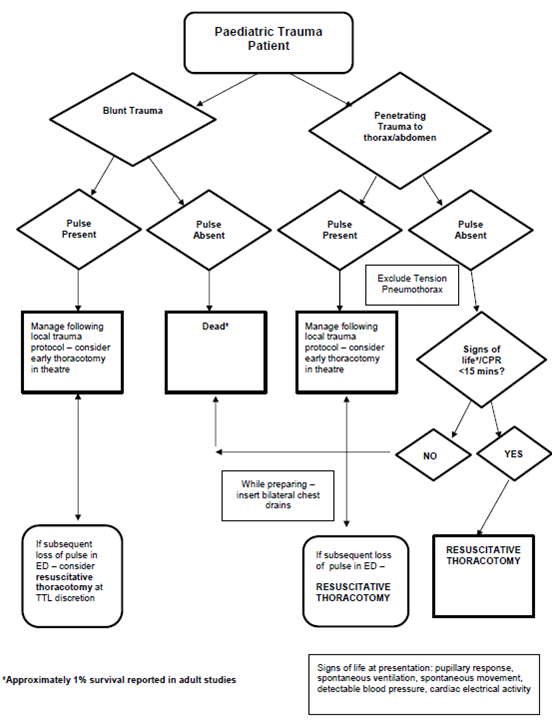
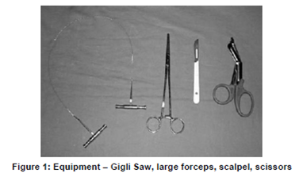
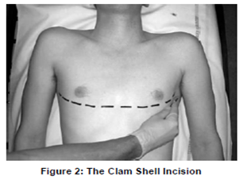
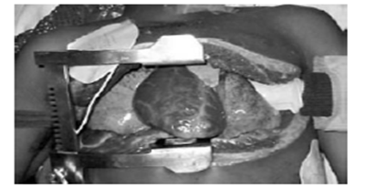

# Resuscitative Thoracotomy

## Aims of Resuscitative Thoracotomy
Last resort in patients with serve traumatic injuries in or distal to the thorax

Aims of resuscitative thoracotomy 
Drain cardiac tamponade
Control significant intra-thoracic haemorrhage
Repair significant cardiac lesion
Apply pressure to the aorta (with fist) to control distal haemorrhage
Open cardiac massage

Decision to perform resuscitative thoracotomy is made by trauma team leader

## Resuscitative Thoracotomy Procedure

Thoracotomy kit in paeds resus
Position patient supine
Rapid skin preparation

Using scalpel and blunt forceps make bilateral 4cm thoracostomies in usual anatomical locations (5th ICS mid-axillary line)
If tension pneumothorax is decompressed and cardiac output return stop procedure
Insert 2 fingers into a thoracostomy to hold the lung out of the way while cutting through all layers of the pleura and chest wall towards the sternum using heavy scissors. Perform this on both sides leaving only a sternal bridge between the 2 thoracostomies

Cut through the sternum using heavy scissors
Open the clam shell using 1 or 2 self retaining retractors/ rib spreads (if no available using assistants). Ensure wide enough to allow access to thoracic structures
Lift the pericardium with forceps and make a large midline longitudinal incision using scissors (avoid phrenic nerve)
Evacuate blood and clots, look for source of bleeding

1 of 3 scenarios will there likely develop
Heart beat spontaneously and return of cardiac output  closure cardiac wounds
Heart beats slows with reduced cardiac output  close cardiac wounds then supplement cardiac output with internal cardiac massage and inotropes
Heart remains in asystole  close cardiac wounds and supplement cardiac output with internal cardiac massage and inotropes

### Cardiac Massage
2-handed technique: one hand placed posteriorly and one anterior and ‘milk’ blood from apex upwards at approx. 80 beats per minute. Alternative with smaller heart place fingers posteriorly and thumb anteriorly
Ensure heart remains horizontal to promote venous return

Repair of cardiac lacerations
Holes <1cm occlude with finger/ gauze
Larger holes place a Foley catheter through the hole, inflate and gently pull back
Use <10ml water in the balloon (it will reduce ventricular volume)
Ensure catheter is clamped to prevent blood loss
If this does not control bleeding closure with sutures. Use minimum sutures to avoid damaging coronary arteries (size 1/0 or 0./0, 1-2cm bites) 

Defibrillation 
Close clamshell and defibrillate using standard protocols

Re-perfusion
Restoration of circulation will result in bleeding
Control large bleeders with artery forceps
Theatre for definitive management

--- 
eResus v2.0 based on [Resuscitative thoracotomy v1.1](http://workspaces/sites/Teams/ChildrensEmergencyDepartment/guidelines/BCH_guidelines/1/index.html#19455)