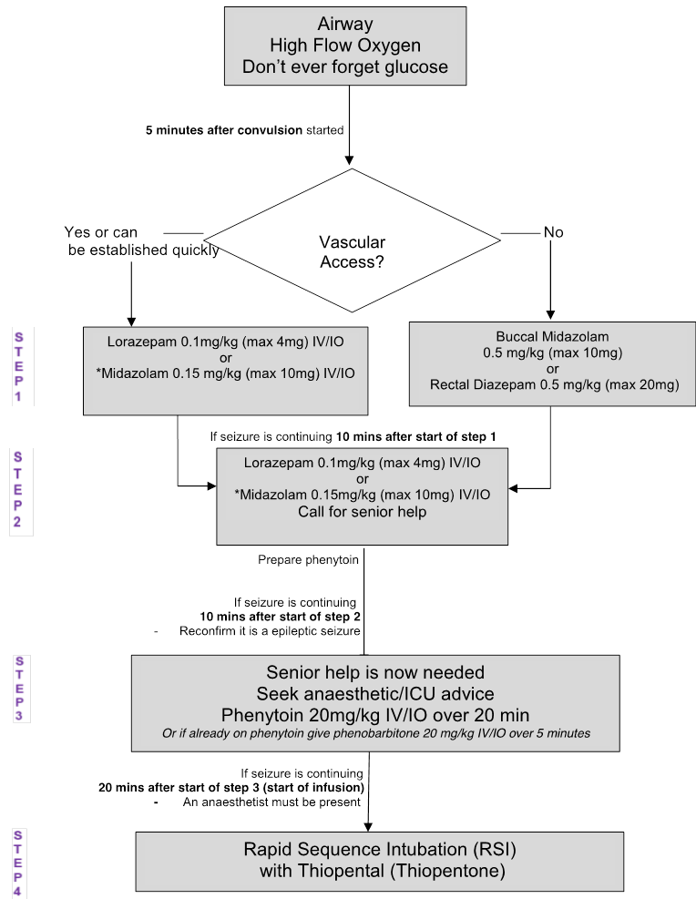
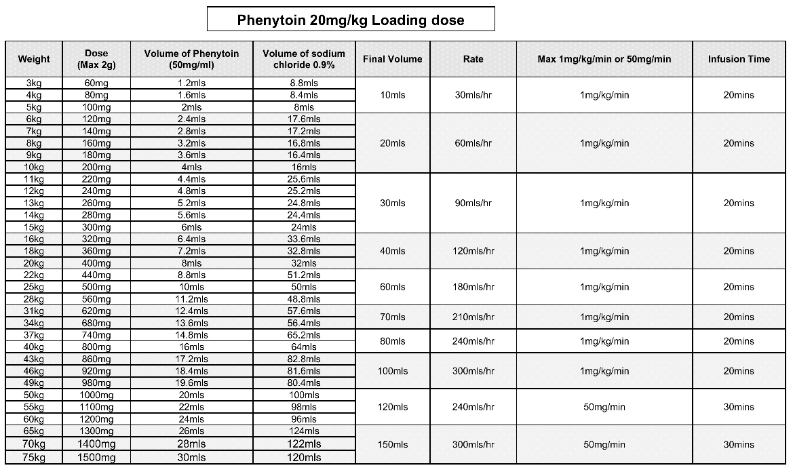

# Status Epilepticus

Consider paraldehyde 0.8mls/kg (max 20ml) while waiting for phenytoin to be drawn up.

### Phenytoin Infusion table

--- 
eResus v2.0 based on [Status Epilepticus v 1.0](http://workspaces/sites/Teams/ChildrensEmergencyDepartment/guidelines/BCH_guidelines/1/index.html#13077)

https://www.alsg.org/en/files/APLS/APLS_6e_Manual_updates.pdf
